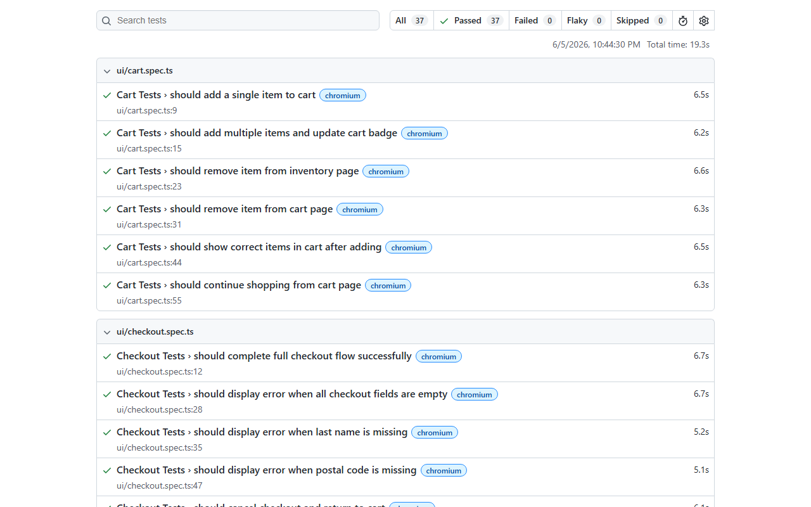

# SauceDemo & ReqRes Test Automation (Playwright + TypeScript)

A highly structured, modern QA automation framework built using **Playwright Test** and **TypeScript**. It automates UI flows on [saucedemo.com](https://www.saucedemo.com) and API tests on [reqres.in](https://reqres.in), following the **Page Object Model (POM)** design pattern.

---

## 🚀 Key Features

* **Page Object Model (POM)**: Cleaner code structure separation between page locators/interactions and test scripts.
* **API Testing Integration**: Validates REST endpoints including positive and negative authentication/CRUD operations.
* **Custom Fixtures**: Automatically provides page instances and handles session setup (`authenticatedPage`).
* **Zero Hard Waits**: Leverages Playwright's auto-waiting and web-first assertions for maximum test stability.
* **Parallel Execution & Retries**: Designed for horizontal scaling and handles flaky environments gracefully.
* **Robust Reporting**: Generates HTML reports complete with screenshots and trace logs captured on failure.
* **CI/CD Integration**: Integrated with GitHub Actions to trigger test suites on push/pull requests.

---

## 📂 Project Structure

```text
demosauce/
├── .github/
│   └── workflows/
│       └── playwright.yml    # CI/CD GitHub Actions workflow
├── fixtures/
│   └── test-fixtures.ts      # Custom fixtures for POM injection and auto-login
├── pages/                    # Page Object Model classes
│   ├── LoginPage.ts
│   ├── InventoryPage.ts
│   ├── CartPage.ts
│   ├── CheckoutPage.ts
│   └── CheckoutCompletePage.ts
├── tests/                    # UI and API test specifications
│   ├── api/                  # ReqRes API tests
│   │   ├── auth.spec.ts
│   │   ├── negative-api.spec.ts
│   │   └── users.spec.ts
│   └── ui/                   # SauceDemo UI tests
│       ├── cart.spec.ts
│       ├── checkout.spec.ts
│       ├── inventory.spec.ts
│       ├── login.spec.ts
│       └── navigation.spec.ts
├── utils/                    # Data models and utility functions
│   ├── api-helpers.ts
│   └── test-data.ts          # Centralized test constants
├── .env                      # Local environment configurations (ignored)
├── .gitignore
├── playwright.config.ts      # Playwright runner configuration
├── tsconfig.json             # TypeScript settings
├── TEST_PLAN.md              # Detailed Test Strategy & Test Cases
└── README.md
```

---

## 🛠️ Setup & Installation

### Prerequisites
* [Node.js](https://nodejs.org/) (v18 or higher recommended)
* npm (v9 or higher)

### 1. Clone the repository
```bash
git clone <repository_url>
cd demosauce
```

### 2. Install dependencies
```bash
npm install
```

### 3. Install Playwright browsers
```bash
npx playwright install chromium
```

---

## 🚦 Running Tests

All script tasks are structured through npm commands.

### Run all tests (UI & API)
```bash
npm test
```

### Run UI tests only
```bash
npm run test:ui
```

### Run API tests only
```bash
npm run test:api
```

### Run tests in headed mode (visible browser)
```bash
npx playwright test --headed
```

### Run a specific test file
```bash
npx playwright test tests/ui/login.spec.ts
```

---

## 📊 Reports & Debugging

If any test fails, Playwright automatically generates a report and captures screenshots/traces.

### View HTML Report
```bash
npm run report
```

### Trace Viewer
Traces are captured on failure. You can open any trace file using:
```bash
npx playwright show-trace path/to/trace.zip
```
Or view them directly within the HTML report.

---

## 🤖 CI/CD Integration

This project is configured with **GitHub Actions**. The pipeline automatically:
1. Triggers on push and pull requests to the `main` and `develop` branches.
2. Installs dependencies and browser binaries.
3. Runs the test suite in headless mode.
4. Uploads the HTML test report and test traces as artifacts, accessible from the run's summary page.

---

## 📈 Execution Report Screenshot

Here is the screenshot of the latest successful local test run report (37/37 passing):


